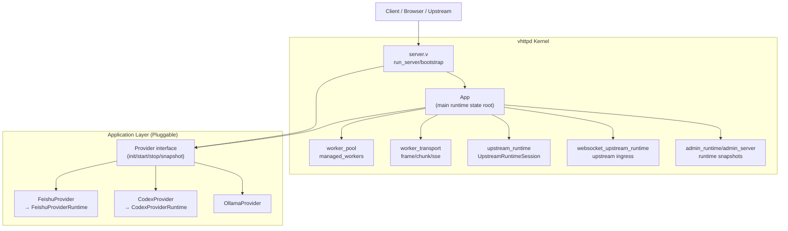
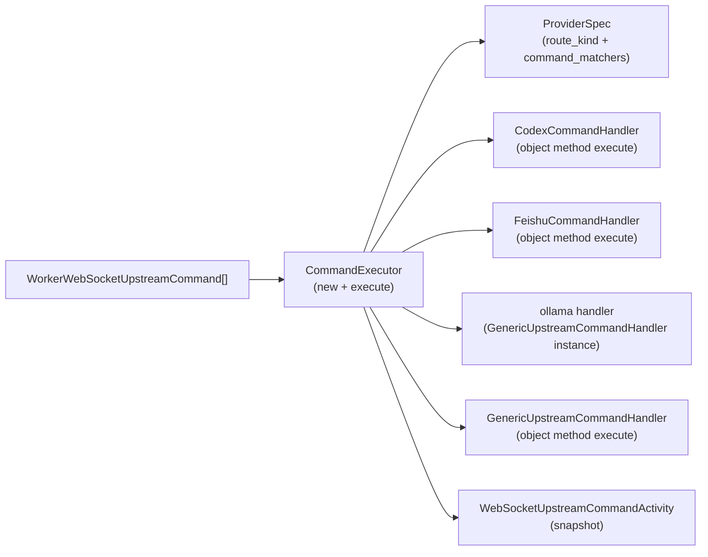
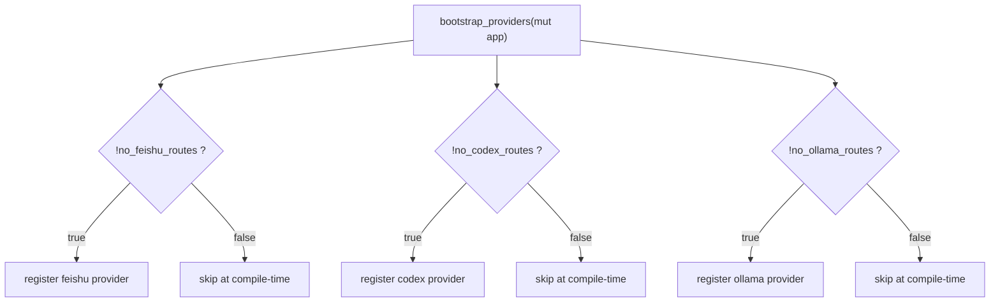
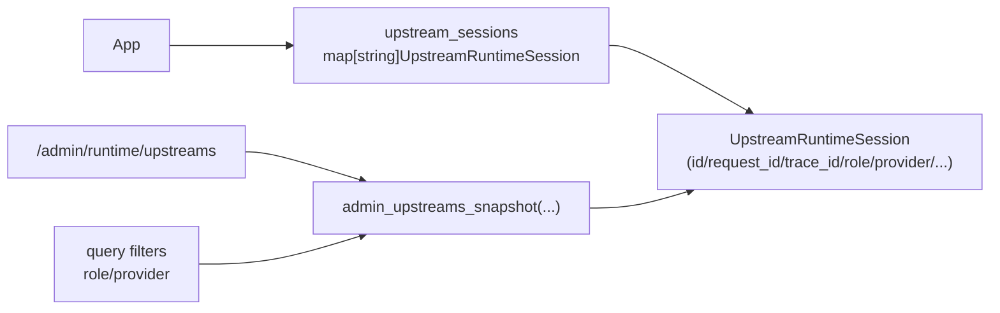
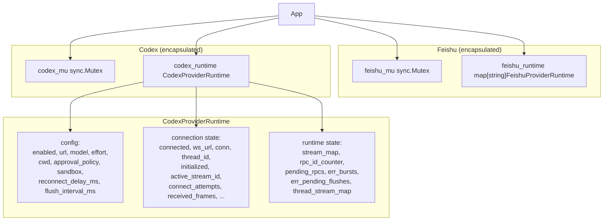

# vhttpd Major Struct Relationship Map

这页聚焦你最关心的内容：**主要结构体之间的关系图**（不是功能说明书）。

目标：快速回答

- 哪些 struct 是内核（transport + workpool）
- 哪些 struct 是应用层可插拔（provider / command handler）
- 命令从哪里进入、在哪里分发、如何执行
- 编译期开关（`no_*_routes`）会影响哪些结构

---

## 1) Core Runtime Struct Graph (Kernel-first)

说明：

- `App` 是 runtime 根结构体，统一持有 transport/workpool/session/provider 状态。
- provider 是应用层适配，不反向定义 kernel 行为。
- provider 状态封装在各自的 runtime struct 中（如 `FeishuProviderRuntime`、`CodexProviderRuntime`），不再散落在 `App` 上。
- `App` 仅保留 provider 级别的 mutex（`feishu_mu`、`codex_mu`）和对应的 runtime 实例。

---

## 2) Command Execution Struct Graph (Object + Static Method Style)

说明：

- 构造/路由决策使用静态方法（`TypeName.method()`）。
- 执行行为使用对象方法（`fn (mut x T) ...`）。

---

## 3) Provider Bootstrap + Compile-time Gate Graph

对应结构关系：

- `CommandExecutor.feishu_route_enabled/codex_route_enabled/ollama_route_enabled`
- `ProviderSpec.route_kind` + `ProviderSpec.command_matchers`
- `provider_bootstrap.v` 的 provider 注册 gate

---

## 4) Runtime Session / Observability Struct Graph

说明：

- 现在 `UpstreamRuntimeSession` 已有 `role/provider`，用于明确语义边界。
- admin 查询支持按 `role/provider` 过滤，利于多 provider 并存时排障。

---

## 5) Provider Runtime Encapsulation Pattern

说明：

- 每个 provider 的运行时状态收敛到一个专属 struct（如 `CodexProviderRuntime`），不再在 `App` 上散列字段。
- `sync.Mutex` 保留在 `App` 上（`feishu_mu`、`codex_mu`），不嵌入 runtime struct 内部，避免 V 语言对嵌套 mutex 的潜在限制。
- `CodexProviderRuntime` 内部分三层：config（TOML/CLI 来源）、connection state（WebSocket 生命周期）、runtime state（maps/counters/error 聚合）。
- `ollama_enabled` 目前仍是 `App` 上的独立字段，未来可按相同模式封装。

---

## 6) Practical Reading Order

建议按这个顺序读源码：

1. `src/main.v`（`App` / runtime root structs）
2. `src/server.v` + `src/provider_bootstrap.v`（启动与 provider 挂载）
3. `src/command_executor.v` + `src/command_handlers.v`（命令分发与执行）
4. `src/upstream_runtime.v` + `src/websocket_upstream_runtime.v`（session 与 upstream ingress）
5. `src/feishu_runtime.v` + `src/codex_runtime.v`（provider runtime 封装）
6. `src/admin_runtime.v` + `src/admin_server.v`（可观测输出）
