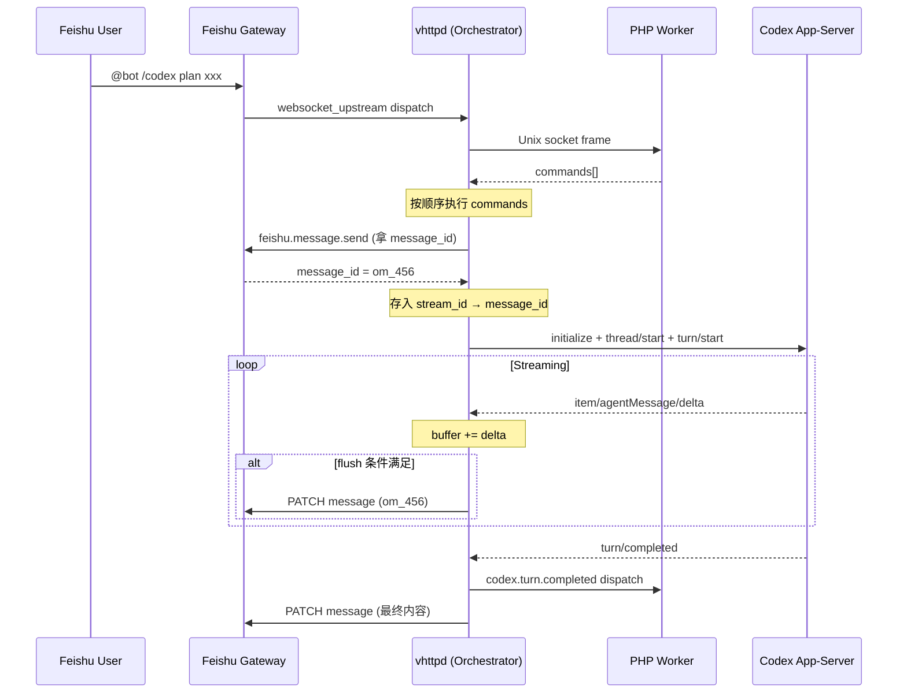

# Codex Upstream 集成方案 (v2)

> 基于 [Codex App Server 官方文档](https://developers.openai.com/codex/app-server/) 修正

## 架构总览



## 传输选型：WebSocket

| 维度 | stdio | WebSocket |
|------|-------|-----------|
| 部署方式 | vhttpd 必须 spawn codex 子进程 | codex 独立启动，vhttpd 连接 |
| 连接模型 | 进程管道（1:1 绑定） | 网络连接（可多 vhttpd 共享） |
| 与现有架构匹配度 | ❌ V 语言管 pipe 很复杂 | ✅ 和 Feishu Gateway WS 完全同构 |
| 消息格式 | JSONL (一行一条) | 一个 WebSocket text frame 一条 |
| 协议内容 | **完全相同** | **完全相同** |
| 过载保护 | 无 | `-32001` 错误码 + 退避重试 |

**启动方式**:
```bash
codex app-server --listen ws://127.0.0.1:4500
```

## Codex App-Server 协议详解

### 协议基础

- JSON-RPC 2.0，但 **wire 上省略 `"jsonrpc":"2.0"` 字段**
- Request: 有 `method` + `params` + `id`
- Response: 有 `id` + `result` 或 `error`
- Notification: 有 `method` + `params`，**无 `id`**

### 生命周期

```
vhttpd 连接 → initialize → initialized → thread/start → turn/start → streaming → turn/completed
```

### 1️⃣ initialize (握手)

```json
{
  "method": "initialize",
  "id": 0,
  "params": {
    "clientInfo": {
      "name": "vhttpd",
      "title": "vhttpd Codex Integration",
      "version": "0.1.0"
    },
    "capabilities": {
      "experimentalApi": true
    }
  }
}
```

响应:
```json
{ "id": 0, "result": { "userAgent": "codex-app-server/..." } }
```

然后紧接着发:
```json
{ "method": "initialized", "params": {} }
```

### 2️⃣ turn/start (提交任务)

```json
{
  "method": "turn/start",
  "id": 2,
  "params": {
    "task": {
        "type": "plan",
        "prompt": "给 vhttpd 增加 codex upstream"
    },
    "model": "o4-mini",
    "effort": "medium",
    "approvalPolicy": "never"
  }
}
```

响应:
```json
{
  "id": 2,
  "result": {
    "turn": {
      "id": "turn_456",
      "status": "inProgress",
      "items": [],
      "error": null
    }
  }
}
```

### 3️⃣ Streaming Notifications (Codex → vhttpd)

#### Turn 事件
```json
{"method": "turn/started", "params": {"turn": {"id": "turn_456"}}}
{"method": "turn/completed", "params": {"turn": {"id": "turn_456", "status": "completed"}}}
```

#### Item 生命周期
```json
{"method": "item/agentMessage/delta", "params": {"itemId": "item_1", "delta": "已"}}
{"method": "item/agentMessage/delta", "params": {"itemId": "item_1", "delta": "定位"}}
```

## 执行流程 (混合模式)

 1. **Feishu 消息到达** → vhttpd 收到 event。
 2. **Worker Dispatch** → PHP worker 识别意图。
 3. **Initiation** → PHP 返回 `feishu.message.send` (带 stream_id) 和 `codex.turn.start`。
 4. **Capturing** → vhttpd 拦截发信指令，记录 `stream_id` → `message_id` 的映射。
 5. **Native Streaming** → vhttpd 收到 Codex delta，直接 PATCH 飞书，不通过 PHP。
 6. **Completion** → Codex 结束，vhttpd 给 PHP 发送 `codex.turn.completed` 回调。

## 核心原则

1. **PHP 无状态** — PHP 只做意图识别 + 结果处理，不持有任何流状态。
2. **vhttpd 原生推流** — 为了极致性能，高频推流在 vhttpd 层直接完成。
3. **混合架构** — 结合了 PHP 的业务灵活性和 V 的系统级性能。
